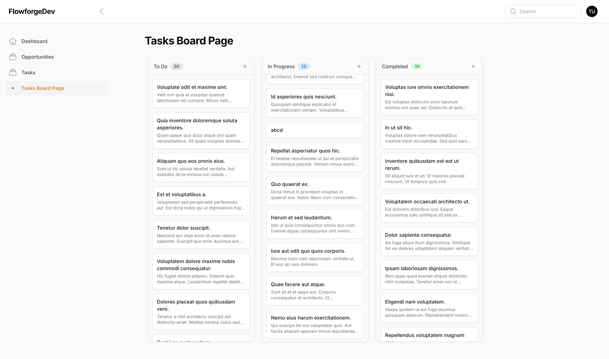

# Flowforge - Powerful Laravel Filament Kanban Board

[](https://packagist.org/packages/relaticle/flowforge)
[](https://php.net)
[](https://laravel.com)
[](https://filamentphp.com)
[](https://packagist.org/packages/relaticle/flowforge)
[](LICENSE.md)

Flowforge is a powerful Kanban board package for Laravel Filament 3 that works seamlessly with your existing Eloquent models. This package allows you to transform any model into a Kanban board with minimal configuration, without requiring additional database tables.



## 📋 Table of Contents

- [🛠️ Requirements](#️-requirements)
- [🔥 Quick Start](#-quick-start)
- [🌟 Features](#-features)
- [🏗️ Model Preparation](#️-model-preparation)
- [✅ Required Configuration](#-required-configuration)
- [🔄 Optional Methods](#-optional-methods)
- [🧩 Optional Configuration](#-optional-configuration)
- [❓ Troubleshooting](#-troubleshooting)
- [👨‍💻 Contributing](#-contributing)
- [📃 License](#-license)

## 🛠️ Requirements

- PHP 8.3+
- Laravel 11+
- Filament 3.x

## 🔥 Quick Start

This guide will help you set up a Kanban board for your Laravel application in just a few minutes.

### Step 1: Install Flowforge

```bash
composer require relaticle/flowforge
```

### Step 2: Prepare Your Model

For a basic Kanban board, your model needs:

1. A title field (e.g., `title` or `name`)
2. A status field to determine column placement (e.g., `status` or `state`)
3. An order field for drag & drop (e.g., `order_column`) - required for drag & drop functionality

Example migration:

```php
Schema::create('tasks', function (Blueprint $table) {
    $table->id();
    $table->string('title');
    $table->text('description')->nullable();
    $table->string('status')->default('todo');
    $table->integer('order_column')->nullable();
    $table->timestamps();
});
```

### Step 3: Generate a Minimal Kanban Board

Use the provided command to create a basic board:

```bash
php artisan flowforge:make-board TasksBoard --model=Task
```

The command will only ask for:
- Board name (if not provided as argument)
- Model name (if not provided with --model flag)

This command will:
1. Create a minimal read-only Kanban board page for your model
2. Set up default columns (todo, in_progress, completed)
3. Generate clean, concise code with no unnecessary comments

### Step 4: Register the Page

Add your new page to Filament's navigation:

```php
// In app/Providers/Filament/AdminPanelProvider.php

public function panel(Panel $panel): Panel
{
    return $panel
        // ... other configuration
        ->pages([
            // ... other pages
            App\Filament\Pages\TasksBoardPage::class,
        ]);
}
```

### Step 5: Visit Your Board

Go to your Filament admin panel and you should see your new Kanban board in the navigation!

The generated board is intentionally minimal - it gives you a working read-only board to start with. When you're ready to add interactive features, you can manually add the `createAction()` and `editAction()` methods following the examples in the [Optional Methods](#-optional-methods) section.

## 🌟 Features

Flowforge offers several powerful features out of the box:

- **Model Agnostic**: Works with any existing Eloquent model
- **No Additional Tables**: Uses your existing models and database structure
- **Read-Only Option**: Create simple view-only boards with minimal code
- **Drag and Drop**: Move cards between columns or reorder them within a column
- **Optional Create/Edit**: Add card creation and editing only if you need it
- **Order Persistence**: Automatically saves card order when dragged
- **Column Colors**: Customize column colors or use auto-generated colors
- **Responsive Design**: Works on all device sizes
- **Customizable Cards**: Display additional model attributes on cards
- **Search Functionality**: Built-in search across specified model fields
- **Integration Support**: Works with other packages like custom fields systems

## 🏗️ Model Preparation

For your Kanban board to be fully functional, your model should have:

1. A field for the card title (e.g., `title`, `name`)
2. A field for the column/status (e.g., `status`, `state`)
3. A field for description (e.g., `description`, `content`) - optional
4. A field for order (e.g., `order_column`, `sort_order`) - required for drag & drop functionality

For drag and drop ordering to work, you can either:

1. Add an integer column to your model migration (as shown in the Quick Start section), or
2. Use a package like [spatie/eloquent-sortable](https://github.com/spatie/eloquent-sortable)

## ✅ Required Configuration

For a functional Kanban board, you only need to implement **two methods**:

### 1. getSubject() - Provides the data source
```php
public function getSubject(): Builder
{
    return Task::query();
}
```

### 2. mount() - Configures the board
```php
public function mount(): void
{
    $this
        ->titleField('title');      // Required: Field used for card titles
        ->columnField('status')     // Required: Field that determines column placement
        ->columns([                 // Required: Define your columns
            'todo' => 'To Do',
            'in_progress' => 'In Progress',
            'completed' => 'Completed',
        ])
}
```

### Example: Minimal Read-Only Board

Here's a complete example of a minimal read-only board:

```php
<?php

namespace App\Filament\Pages;

use App\Models\Task;
use Illuminate\Database\Eloquent\Builder;
use Relaticle\Flowforge\Filament\Pages\KanbanBoardPage;

class TasksBoardPage extends KanbanBoardPage
{
    protected static ?string $navigationIcon = 'heroicon-o-view-columns';

    public function getSubject(): Builder
    {
        return Task::query();
    }

    public function mount(): void
    {
        $this
            ->titleField('title');
            ->columnField('status')
            ->columns([
                'todo' => 'To Do',
                'in_progress' => 'In Progress',
                'completed' => 'Completed',
            ])
    }
}
```

## 🔄 Optional Methods

These methods are completely optional and only needed if you want specific functionality:

### createAction() - For creating new cards

If you want users to be able to add new cards to the board, implement this method:

```php
use Filament\Actions\Action;
use Filament\Forms;

public function createAction(Action $action): Action
{
    return $action
        ->iconButton()
        ->icon('heroicon-o-plus')
        ->modalHeading('Create Task')
        ->modalWidth('xl')
        ->form(function (Forms\Form $form) {
            return $form->schema([
                Forms\Components\TextInput::make('title')
                    ->required()
                    ->placeholder('Enter task title')
                    ->columnSpanFull(),
                Forms\Components\Textarea::make('description')
                    ->columnSpanFull(),
                // Add more form fields as needed
            ]);
        });
}
```

**Note:** If this method is not implemented, no "+" button will appear in column headers and users won't be able to create new cards.

### editAction() - For editing existing cards

If you want users to be able to edit existing cards, implement this method:

```php
use Filament\Actions\Action;
use Filament\Forms;

public function editAction(Action $action): Action
{
    return $action
        ->modalHeading('Edit Task')
        ->modalWidth('xl')
        ->form(function (Forms\Form $form) {
            return $form->schema([
                Forms\Components\TextInput::make('title')
                    ->required()
                    ->placeholder('Enter task title')
                    ->columnSpanFull(),
                Forms\Components\Textarea::make('description')
                    ->columnSpanFull(),
                Forms\Components\Select::make('status')
                    ->options([
                        'todo' => 'To Do',
                        'in_progress' => 'In Progress',
                        'completed' => 'Completed',
                    ])
                    ->required(),
                // Add more form fields as needed
            ]);
        });
}
```

**Note:** If this method is not implemented, cards will be read-only and users won't be able to edit them.

## 🧩 Optional Configuration

These settings enhance your board but are not required:

- `descriptionField(string)`: Field used for card descriptions
- `orderField(string)`: Field used to maintain card order (required for drag & drop)
- `columnColors(array)`: Key-value pairs defining colors for each column
- `cardLabel(string)`: Custom label for cards (defaults to model name)
- `pluralCardLabel(string)`: Custom plural label for cards
- `cardAttributes(array)`: Additional model attributes to display on cards
- `initialCardsCount(int)`: Number of cards initially loaded per column (default: 10)
- `cardsIncrement(int)`: Number of cards to load when clicking "load more" (default: 5)

Example with optional configuration:

```php
public function mount(): void
{
    $this
        // Required configuration
        ->columnField('status')
        ->columns([
            'todo' => 'To Do',
            'in_progress' => 'In Progress',
            'completed' => 'Completed',
        ])
        ->titleField('title')
        
        // Optional configuration
        ->descriptionField('description')
        ->orderField('order_column')
        ->columnColors([
            'todo' => 'blue',
            'in_progress' => 'yellow',
            'completed' => 'green',
        ])
        ->cardLabel('Task')
        ->pluralCardLabel('Tasks')
        ->cardAttributes([
            'due_date' => 'Due Date',
            'assignee.name' => 'Assigned To',
        ])
        ->initialCardsCount(15)
        ->cardsIncrement(10);
}
```

### Available Column Colors

Flowforge uses Tailwind CSS color classes for column styling. The available color options are:

- `white`
- `slate`
- `gray`
- `zinc`
- `neutral`
- `stone`
- `red`
- `orange`
- `amber`
- `yellow`
- `lime`
- `green`
- `emerald`
- `teal`
- `cyan`
- `sky`
- `blue`
- `indigo`
- `violet`
- `purple`
- `fuchsia`
- `pink`
- `rose`

If you don't specify colors, they will be automatically assigned from this palette in a rotating manner.

## Custom Adapters

For complex scenarios (like integration with custom fields), you can create a custom adapter by implementing `KanbanAdapterInterface` or extending `DefaultKanbanAdapter`. This is an advanced feature and only needed for special cases.

## ❓ Troubleshooting

### Common Issues and Solutions

#### Cards not draggable

**Issue**: You can see cards but can't drag them between columns or reorder them.

**Solution**:
1. Ensure your model has an integer field for ordering (e.g., `order_column`)
2. Configure this field with `orderField('order_column')` in your `mount()` method
3. Check browser console for JavaScript errors

#### Empty board or missing columns

**Issue**: Your board appears empty or has fewer columns than expected.

**Solution**:
1. Verify your model has records with the status values matching your column keys
2. Check that your `columnField()` matches a real field in your database
3. Use `dd($this->getSubject()->get())` in your page class to debug your model data

#### Form validation errors

**Issue**: Form submissions fail with validation errors.

**Solution**:
1. Ensure all required model fields are included in your forms
2. Check for any unique constraints in your model
3. Look for mutators or observers that might be affecting the data

#### Can't create or edit cards

**Issue**: No create/edit options appear.

**Solution**:
1. Make sure you've implemented `createAction()` and/or `editAction()` methods
2. Check that you've properly imported and used the Filament Action and Forms classes
3. Verify that you've returned the action properly from these methods

#### Cards not saving when dragged

**Issue**: Cards can be dragged but don't stay in place after reload.

**Solution**:
1. Ensure the `orderField()` method is set in your configuration
2. Verify your model is properly saving the order value
3. If using Spatie's Eloquent-Sortable, ensure it's correctly configured

### Advanced Troubleshooting

If you're still experiencing issues, try these steps:

1. Enable debug mode in your Laravel application
2. Check Laravel logs for errors
3. Inspect network requests in your browser's developer tools
4. Verify your Filament and Laravel versions match the requirements
5. Try a simpler configuration first, then add complexity

## 👨‍💻 Contributing

Contributions are welcome! Please feel free to submit a Pull Request.

## 📃 License

The MIT License (MIT). Please see [License File](LICENSE.md) for more information.
