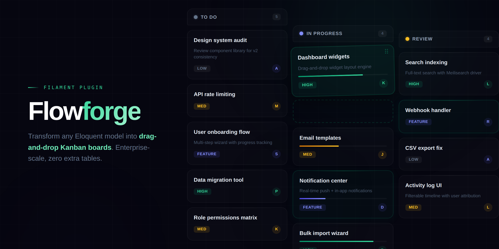

# Flowforge



<a href="https://packagist.org/packages/relaticle/flowforge"></a>
<a href="https://php.net"></a>
<a href="https://filamentphp.com"></a>
<a href="https://github.com/relaticle/flowforge/blob/4.x/LICENSE.md"></a>
<a href="https://github.com/relaticle/flowforge/actions"></a>

Transform any Laravel model into a production-ready drag-and-drop Kanban board. Works with Filament admin panels and standalone Livewire applications.

## Features

- **3 Integration Patterns** - Works with Filament Pages, Resources, or standalone Livewire components
- **Enterprise-Scale Performance** - Cursor-based pagination handles unlimited cards with intelligent loading
- **Rich Card Schemas** - Filament Schema builder creates complex card layouts with forms and components
- **Smart Position Management** - Advanced ranking algorithm with conflict resolution and repair commands
- **Optimistic UI Experience** - Instant visual feedback with loading states and smooth interactions
- **Native Filament Integration** - Deep table system integration for filters, search, and actions

## Requirements

- PHP 8.3+
- Filament 5.x

## Getting Started

```bash
composer require relaticle/flowforge
```

### Standalone Livewire

```php
use Relaticle\Flowforge\Concerns\InteractsWithBoard;

class TaskBoard extends Component implements HasBoard
{
    use InteractsWithBoard;

    public function board(Board $board): Board
    {
        return $board
            ->query(Task::query())
            ->columnIdentifier('status')
            ->positionIdentifier('position')
            ->columns([
                Column::make('todo')->label('To Do')->color('gray'),
                Column::make('in_progress')->label('In Progress')->color('blue'),
                Column::make('completed')->label('Completed')->color('green'),
            ]);
    }
}
```

### Filament Admin Panel

```bash
php artisan flowforge:make-board TaskBoard --model=Task
```

## Documentation

For complete installation instructions, configuration options, and examples, visit our [documentation](https://relaticle.github.io/flowforge/).

## Contributing

Contributions are welcome! Please see our [contributing guide](.github/CONTRIBUTING.md) for details.

## License

MIT License. See [LICENSE.md](LICENSE.md) for details.
