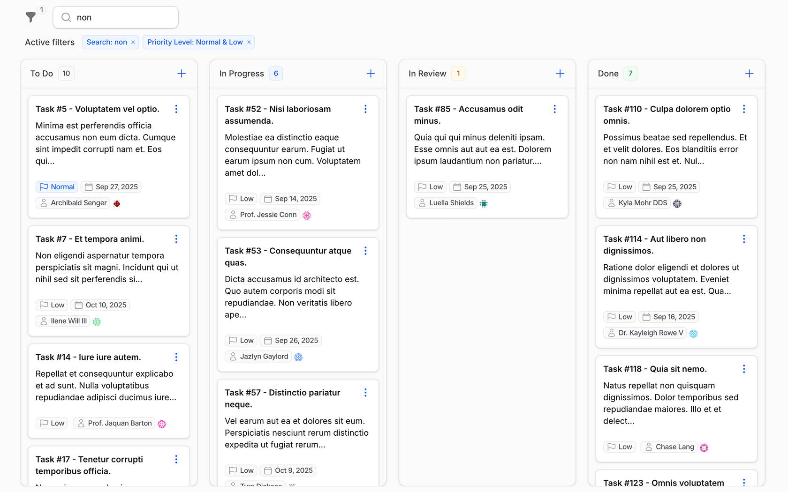

# Flowforge

**Transform any Laravel model into a production-ready drag-and-drop Kanban board.**

[](https://packagist.org/packages/relaticle/flowforge)
[](https://packagist.org/packages/relaticle/flowforge)
[](https://php.net)
[](https://filamentphp.com)
[](https://github.com/relaticle/flowforge/actions)

<div align="center">

</div>

## Why Flowforge?

- **3 Integration Patterns** - Filament Pages, Resources, or standalone Livewire  
- **Production-Ready** - Handles 100+ cards per column with intelligent pagination  
- **Quick Setup** - Get running in 90 seconds with minimal configuration
- **Fully Customizable** - Actions, schemas, filters, and themes

## Documentation

**[View Complete Documentation →](https://relaticle.github.io/flowforge/)**

- [Quick Installation Guide](https://relaticle.github.io/flowforge/getting-started/installation)
- [Integration Patterns](https://relaticle.github.io/flowforge/essentials/integration-patterns)
- [Customization Examples](https://relaticle.github.io/flowforge/essentials/customization)
- [API Reference](https://relaticle.github.io/flowforge/essentials/api-reference)
- [Troubleshooting](https://relaticle.github.io/flowforge/essentials/troubleshooting)

---

## Quick Start

```bash
composer require relaticle/flowforge
```

Add CSS assets to your theme, create a position column, generate your board, and register it in your panel.

**[→ Complete Setup Guide](https://relaticle.github.io/flowforge/getting-started/installation)**

---

## Requirements

- **PHP:** 8.3+
- **Laravel:** 11+  
- **Filament:** 4.x
- **Database:** MySQL, PostgreSQL, SQLite, SQL Server, MariaDB

---

## Contributing

Contributions are welcome! Please feel free to submit a Pull Request.

- [Contributing Guidelines](.github/CONTRIBUTING.md) - How to contribute
- [Developer Guide](CLAUDE.md) - Complete implementation guide and architecture overview
- [Testing Examples](tests/Feature/) - Production-ready test patterns  
- [Report Issues](https://github.com/relaticle/flowforge/issues)

---

## License

MIT License. See [LICENSE.md](LICENSE.md) for details.
